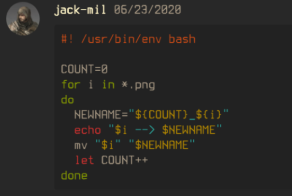

# Gruvy Discord

This is my modification to a custom css theme of Discord.  
Thanks to [ElKowar](https://github.com/elkowar/a-box-of-gruv) for the original, check out the other themes he has here https://github.com/elkowar/a-box-of-gruv.

## Changes

I didn't want to setup BetterDiscord or BeautifulDiscord as originally suggested, so I use this theme with Discord Web. It works great!

The original theme had the same font and style for inline and block formatted code, so I changed the code blocks to use Fira Code (ligatures!)

    
Expand

Before                     | After
:-------------------------:|:-------------------------:
  |  

 

I also tweaked a few visuals and colors to my liking

> **Note:** On Windows, I had to change references to `"Terminus (TTF)"` in the css to `"Terminus (TTF) for Windows`". You might need to change this...

### Prerequisites

This theme uses special fonts. You'll have to either install them or change the fonts in the CSS file.

Fonts used:
- [`Terminus (TTF)`](https://files.ax86.net/terminus-ttf/) (main font)
- [`Fira Code`](https://github.com/tonsky/FiraCode) (code blocks)

### Installation

It's just a custom CSS for Discord Web. You could copy and paste into the header using Chrome inspector if you wanted. But you don't to do *that* every time.  
The `stylus` browser extension (available for Chrome and Firefox and probably more) can be used to apply themes to any website (cool!).

Instructions from [ElKowar](https://github.com/elkowar/a-box-of-gruv):

After installing the extension, click on the little icon and go to `manage`.
In there, you *enable* `as Usercss` and click on "write new style".

Now, select all of the text that is already there, and delete it.
The next step is to paste in the contents of the desired `.styl` file.

If you want to change anything, make sure you set the CSS Linter to "Stylelint", 
as that one will accept the stylus syntax used here.

### Showcase

Original showcase by [ElKowar](https://github.com/elkowar/a-box-of-gruv)

    
Expand

### Desktop
If you *have* a css loader for Discord desktop, or want to get one, this same theme should work fine. Just copy the css, remove the wrapping Userstyle syntax  
`@-moz-document url-prefix("https://discord.com/") {`  
and save it in a file with `.css` extension.